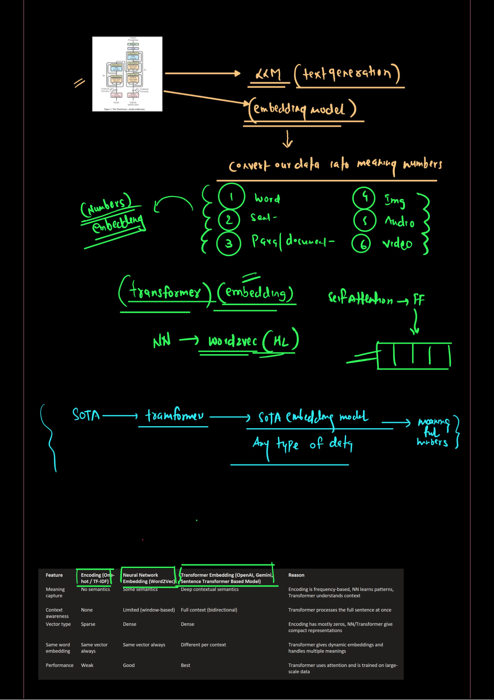
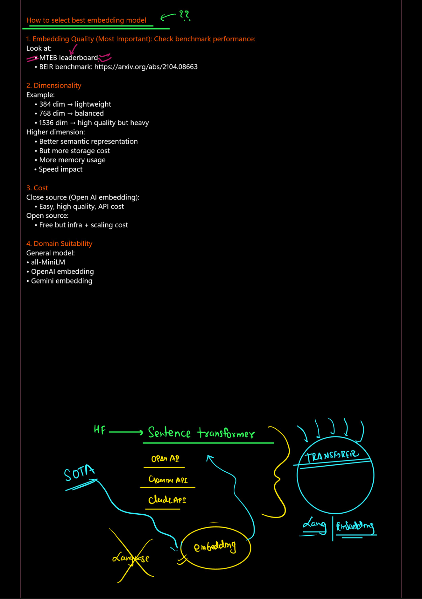
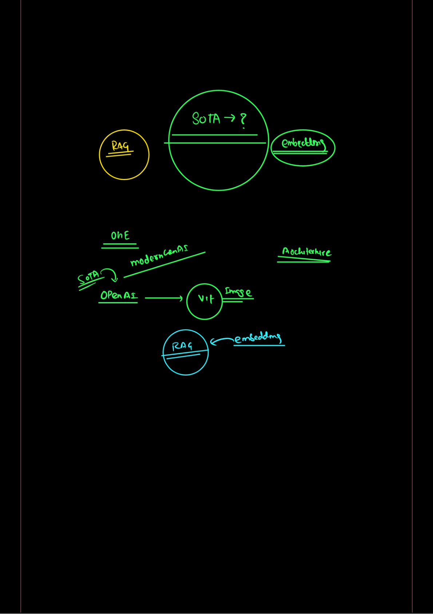

## Evolution of Neural Architectures
The journey to modern AI started with basic Neural Networks (NN) and evolved through specialized models to reach the current State-of-the-Art (SOTA).

* **Neural Networks (NN):** Composed of an Input Layer, Hidden Layer, and Output Layer.
* **Word2Vec:** Utilizes the intermediate output of the Hidden Layer (HL) to create representations.
* **Transformers:** The current backbone for SOTA models like GPT (OpenAI), Gemini (Google), and Hugging Face (HF) models.

*Figure 1: Evolution from NN to Transformer architectures.*

### Key Training Methods
| Model | Training Approach | Example |
| :--- | :--- | :--- |
| **BERT** | **MLM (Masked Language Modeling):** Predicts a "masked" word in a sentence. | "Sunny is [MASK] mentor". |
| **GPT** | **Autoregressive Training:** Predicts the next token based on previous context. | "Sunny is AI mentor". |

---

## The Power of Embeddings
Embeddings convert raw data into "meaningful numbers" that machines can understand. 

* **Universal Data Handling:** Modern embedding models can convert words, sentences, paragraphs, images, audio, and video into vectors.
* **Contextual Awareness:** Unlike older methods, Transformer-based embeddings understand deep contextual semantics.

*Figure 2: Comparing Encoding, NN, and Transformer-based embeddings.*

### Comparison Table
| Feature | One-Hot / TF-IDF | Word2Vec (NN) | Transformer Embedding |
| :--- | :--- | :--- | :--- |
| **Meaning** | No semantics | Some semantics | Deep contextual semantics |
| **Context** | None | Limited (window-based) | Full context (bidirectional) |
| **Vector Type** | Sparse | Dense | Dense |
| **Performance** | Weak | Good | Best |

---

## How to Select the Best Embedding Model
When choosing a model for your project, consider these four critical factors:

1. **Quality (Most Important):** Check benchmarks like the **MTEB leaderboard** or the **BEIR benchmark**.
2. **Dimensionality:**
    * **384 dim:** Lightweight and fast.
    * **768 dim:** Balanced performance.
    * **1536 dim:** High quality but "heavy" (higher storage/memory cost).
3. **Cost:**
    * **Closed Source (OpenAI/Gemini):** High quality and easy to use, but involves API costs.
    * **Open Source:** Free to use, but requires infrastructure and scaling costs.
4. **Domain Suitability:** Use general models like `all-MiniLM` or specific APIs (Claude, Gemini) depending on your requirements.

*Figure 3: Criteria for selecting the best embedding model.*

---

## Modern AI Applications
The intersection of SOTA embeddings and architectures enables advanced workflows:
* **RAG (Retrieval-Augmented Generation):** Combining search and generation for accurate AI responses.
* **Vision Transformers (ViT):** Applying Transformer architectures to image data.

*Figure 4: The role of SOTA embeddings in RAG architectures.*
