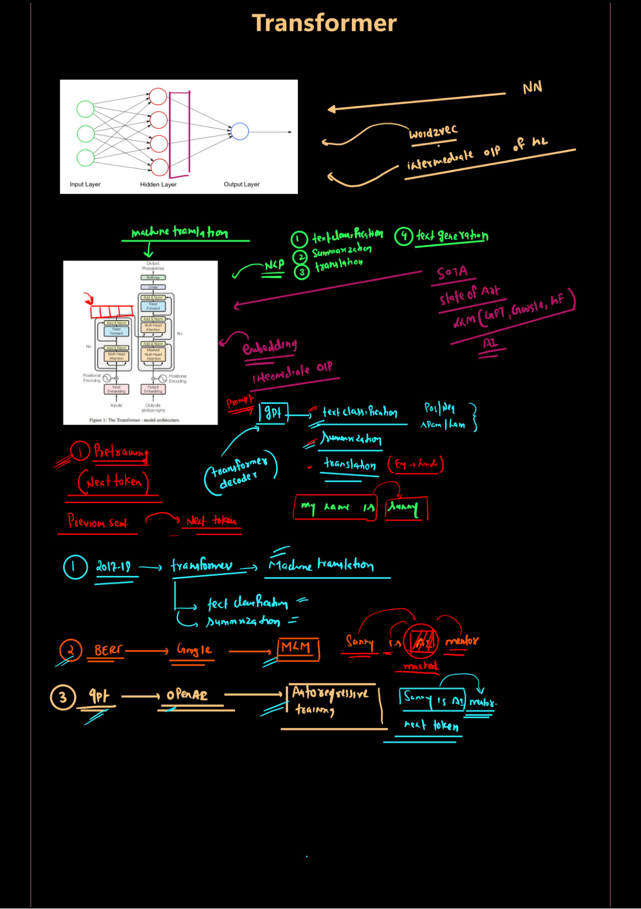

## Evolution of NLP Models
Before Transformers, sequence data was processed using models that had significant limitations regarding speed and memory.

* **RNN / LSTM / GRU (2014-2015):** These models processed data sequentially (step-by-step), making them slow and prone to the "vanishing gradient" issue, which limited their long-term memory.
* **Encoder-Decoder with Attention (2015-2016):** Introduced the concept of focusing on specific parts of the input, primarily for machine translation.
* **The Transformer (2017-2018):** Introduced in the paper "Attention is All You Need," this model replaced recurrence with **Self-Attention**, allowing for parallel processing of all tokens at once.

---

## Transformer vs. LSTM
Processing style and speed are the primary differentiators between older recurrent architectures and modern Transformers.

| Feature | RNN / LSTM | Transformer |
| :--- | :--- | :--- |
| **Processing Style** | Sequential (step-by-step) | Parallel (all tokens at once) |
| **Speed** | Slow | Fast |
| **Long-term Dependency** | Limited (vanishing gradient) | Very strong |
| **Architecture** | Gates: input, forget, output | Attention-based (self-attention) |

---

## Detailed Transformer Architecture
The Transformer consists of two main components: the **Encoder** and the **Decoder**.

### The Encoder Side
1. **Input Tokenization & Embedding:** Raw text is broken into tokens and converted into vectors.
2. **Positional Encoding (PE):** Since Transformers process tokens in parallel, PE is added to give the model information about the sequence order.
3. **Multi-Head Self-Attention:** The model calculates the weightage of every word in relation to every other word in the same sentence.
4. **Feed-Forward Network (FFNN):** A neural network applied to each token position independently.

### The Decoder Side
1. **Output Sequence (Shifted Right):** The target sequence is fed into the decoder during training.
2. **Masked Multi-Head Attention:** Prevents the model from looking at future tokens.
3. **Cross Attention:** The decoder interacts with the encoder's output to understand input context.
4. **Linear & Softmax Layer:** Converts vectors into probabilities to predict the next token.

---

## Understanding Self-Attention
Self-attention creates **dynamic embeddings**. It allows a word to change its vector representation based on the surrounding context.

> **Example:** "Apple launched a new phone while I was eating the apple."
> * The first **"Apple"** weightage leans toward "launched" and "phone" (the company).
> * The second **"apple"** weightage leans toward "eating" (the fruit).

*Figure: A word looking at other words in the same sentence to understand its meaning.*

---

## Modern LLM Landscape
The Transformer architecture is the foundation for almost all modern Large Language Models (LLMs):
* **Encoder-only:** BERT.
* **Decoder-only:** GPT series, Llama, Mistral, and DeepSeek.
* **Multimodal:** Gemini and Claude.